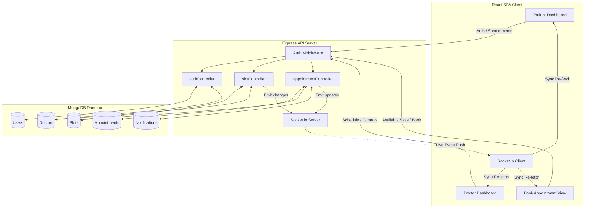
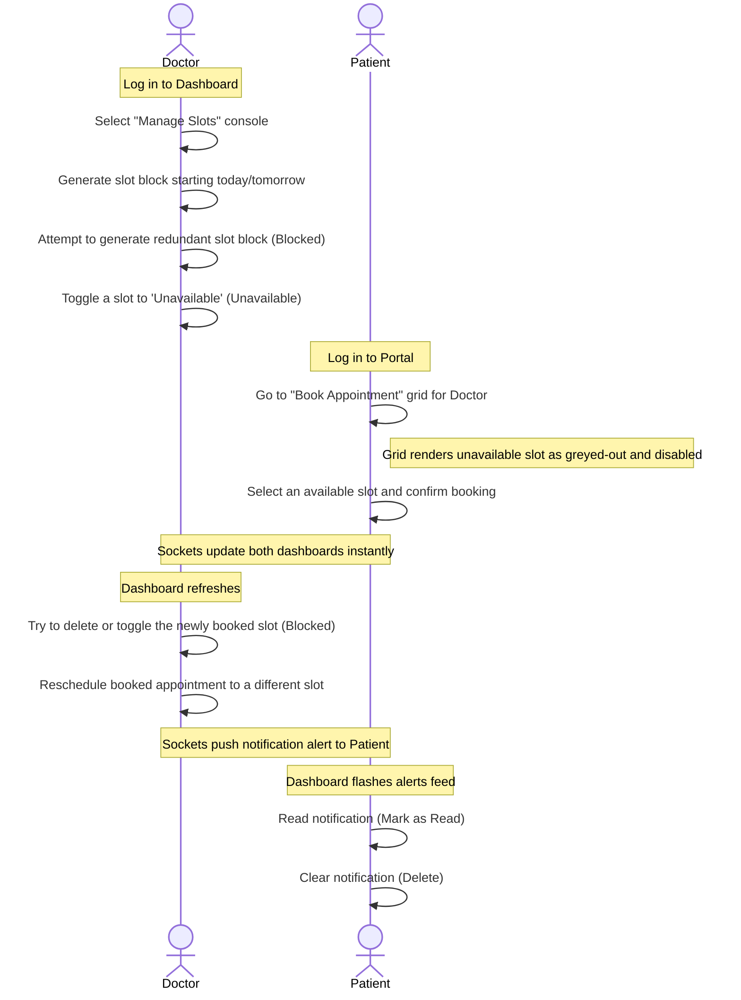

# Aura Clinic Operations Node - Engineering Walkthrough & Design Specifications

This document serves as the complete, technical reference manual and development design history for the **Patient Appointment Booking System** built on a monochromatic dark-mode MERN stack. It outlines the architectural design, database schemas, feature milestones, engineering constraints, and testing procedures.

---

## 🏗️ 1. Core Architecture & Tech Stack

The system is split into two primary decoupled nodes (Backend REST API Server and Frontend Single Page Application) communicating over secure HTTP REST endpoints and state-synchronized WebSockets.

### 📐 System Flow Diagram


### 💻 Tech Stack Choice
* **Database:** MongoDB (using Mongoose ODM for schemas).
* **Server:** Express.js running on Node.js.
* **Frontend:** React.js bootstrapped with Vite, styled using Tailwind CSS and React Icons.
* **Real-time Engine:** Socket.io (websockets connection engine) to sync calendars and push notifications instantly without manual reloads.
* **Security:** JWT (JSON Web Tokens) for role-based route authorization (`patient`, `doctor`, `admin`).

### 🛡️ CORS Preflights Resolution
To prevent preflight blocks during cross-origin requests, the CORS middleware in [server.js](file:///d:/jaypee/backend/src/server.js) was configured to explicitly return `200 OK` on preflights (via `optionsSuccessStatus: 200`) instead of the default `204 No Content`, ensuring full compatibility with modern browser preflight checks:
```javascript
app.use(cors({
  origin: process.env.FRONTEND_URL || 'http://localhost:5173',
  credentials: true,
  optionsSuccessStatus: 200
}));
```

---

## 🗄️ 2. Database Models & Schema Specifications

The system runs on five core Mongoose Schemas. All schemas are designed to preserve referential integrity and support rapid aggregations.

### 1. User Model (`User.js`)
Handles registration, login credentials, and core roles.
* Path: [User.js](file:///d:/jaypee/backend/src/models/User.js)
```javascript
const UserSchema = new mongoose.Schema({
  email: { type: String, required: true, unique: true },
  password: { type: String, required: true },
  role: { type: String, enum: ['patient', 'doctor', 'admin'], default: 'patient' }
});
```

### 2. Doctor Model (`Doctor.js`)
Contains the clinician's profile information linked back to their user account.
* Path: [Doctor.js](file:///d:/jaypee/backend/src/models/Doctor.js)
```javascript
const DoctorSchema = new mongoose.Schema({
  user: { type: mongoose.Schema.Types.ObjectId, ref: 'User', required: true },
  name: { type: String, required: true },
  specialization: { type: String, required: true },
  biography: { type: String }
});
```

### 3. Slot Model (`Slot.js`)
Tracks discrete time chunks generated by doctors. Holds scheduling statuses.
* Path: [Slot.js](file:///d:/jaypee/backend/src/models/Slot.js)
```javascript
const SlotSchema = new mongoose.Schema({
  doctor: { type: mongoose.Schema.Types.ObjectId, ref: 'Doctor', required: true },
  startTime: { type: Date, required: true },
  endTime: { type: Date, required: true },
  status: { type: String, enum: ['available', 'booked', 'unavailable'], default: 'available' }
});
```

### 4. Appointment Model (`Appointment.js`)
Represents the locked relationship between a patient, doctor, slot, and reason.
* Path: [Appointment.js](file:///d:/jaypee/backend/src/models/Appointment.js)
```javascript
const AppointmentSchema = new mongoose.Schema({
  patient: { type: mongoose.Schema.Types.ObjectId, ref: 'User', required: true },
  doctor: { type: mongoose.Schema.Types.ObjectId, ref: 'Doctor', required: true },
  slot: { type: mongoose.Schema.Types.ObjectId, ref: 'Slot', required: true },
  reason: { type: String },
  status: { type: String, enum: ['pending', 'approved', 'rejected'], default: 'pending' }
}, { timestamps: true });
```

### 5. Notification Model (`Notification.js`)
Stores rescheduling alerts and schedule changes targeted to patients.
* Path: [Notification.js](file:///d:/jaypee/backend/src/models/Notification.js)
```javascript
const NotificationSchema = new mongoose.Schema({
  patient: { type: mongoose.Schema.Types.ObjectId, ref: 'User', required: true },
  message: { type: String, required: true },
  reason: { type: String },
  read: { type: Boolean, default: false }
}, { timestamps: true });
```

---

## 🗓️ 3. Chronological Development Phases

Development was divided into five distinct chapters to ensure robust testing, modular components, and atomic commits.

### Chapter 1: Foundation and Authentication
1. **Repository Setup:** A git repository was initialized in the workspace, configuring `.gitignore` to prevent tracking dependency files or environment secrets.
2. **REST Auth API:** Implemented JWT-based register/login routes. Role verification middlewares were constructed in [auth.js](file:///d:/jaypee/backend/src/middleware/auth.js) to restrict client-side updates.
3. **Frontend Integration:** Crafted context providers and protected routes so that doctors and patients are redirected to their respective interfaces upon successful login.

### Chapter 2: The Booking Engine and Concurrency Locks
1. **Doctor Slots Generator:** Created the slot generator in [slotController.js](file:///d:/jaypee/backend/src/controllers/slotController.js) allowing clinicians to define ranges (e.g. 10:00 to 12:00) and step sizes (e.g. 30 minutes) which are automatically split into discrete objects.
2. **Booking Grid:** Added the date-picker slot grid inside [BookAppointment.jsx](file:///d:/jaypee/frontend/src/pages/BookAppointment.jsx). Booked slots were disabled to prevent overlaps.
3. **Concurrency Locking:** Developed an atomic check inside `bookAppointment` using MongoDB queries to confirm the slot status remains exactly `'available'` prior to booking. If a race condition occurs, it returns `409 Conflict`.

### Chapter 3: Live Sockets & Rescheduling
1. **Rescheduling Engine:** Implemented doctor-led rescheduling in [appointmentController.js](file:///d:/jaypee/backend/src/controllers/appointmentController.js). Rescheduling frees the old slot, claims a new slot, updates the appointment record, and fires a DB Notification.
2. **Live Event Broadcasting:** Integrated Socket.io on the backend. Slot updates, bookings, and reschedules trigger server-wide broadcasts (`slots-changed`, `appointments-changed`, `notifications-changed`).
3. **Alerts Feed:** Added an alert system to [PatientDashboard.jsx](file:///d:/jaypee/frontend/src/pages/PatientDashboard.jsx) displaying real-time rescheduling reasons and details with options to mark read and delete.

### Chapter 4: Slots Console & Core Security Constraints
1. **Clinician Slot Console:** Added a tab in [DoctorDashboard.jsx](file:///d:/jaypee/frontend/src/pages/DoctorDashboard.jsx) allowing doctors to toggle slots to `'unavailable'` or delete them.
2. **Validation Safeguards:**
   - Modified `deleteSlot` and `toggleSlotAvailability` controllers to block any updates on slots with a status of `'booked'` to preserve client booking history.
   - Enforced a duplicate date generation guard to block slot generation if any slot already exists for that doctor on the target date.
   - Implemented a past-date generation guard to reject any slot block scheduling that falls in the past.

### Chapter 5: Advanced Usability & Date Formatting
1. **Readable Format (User-facing):** Dates are formatted to include ordinal suffixes (e.g. `29th May 2026`) for readability.
2. **Database Format (Technical):** Displays keep the exact ISO representation `(YYYY-MM-DD)` next to the readable text (e.g., `29th May 2026 (2026-05-29)`) for database consistency and easy visual logging.
3. **Agenda Auto-Advance:** Added a listener to the doctor's dashboard. If today's agenda is empty, it automatically advances the selected agenda view date to the closest future date that contains confirmed appointments.
4. **Appointment Categorization Tabs:** Split the patient's schedule view into **Upcoming Appointments** (sorted nearest first) and **Past Consultations** (sorted most recent first) tabs.

---

## ⚡ 4. Core Features and "Hidden" Mechanics

The system incorporates several subtle design details that ensure consistency and premium usability:

* **Atomic Database Locking:** Preventing double-bookings isn't done on client state; it's locked using a database query `{ _id: slotId, status: 'available' }` within a `findOneAndUpdate` update, resolving concurrent operations safely.
* **WebSocket Silent Hydration:** Sockets are used exclusively to signal client cache updates. Clients listen for signals and silently trigger clean API queries, avoiding huge payload overhead on websockets and preserving standard REST endpoints.
* **Cascading Status Locks:** Once an appointment is marked `'booked'`, the slot is locked. The backend blocks deleting it, marking it unavailable, or generating redundant slots on that day.
* **Auto-Calibrated Date Inputs:** The frontend date select components automatically synchronize boundaries. The "End Date" picker’s minimum value shifts dynamically to match whatever was selected in the "Start Date" picker, reducing user input errors.

---

## 🗓️ 5. Project Roadmap & Releases

This section logs the sequential feature sets added during development sprints:

| Release / Version | Implemented Functionality | Architectural Resolution |
| :--- | :--- | :--- |
| **v1.0.0 (Foundation)** | User authentication, clinician directory, JWT verification. | Solved preflight CORS failures by enforcing explicit `200 OK` preflight options responses on Express server. |
| **v1.1.0 (Real-time Sync)** | Dynamic booking grid and active Socket.io state synchronization. | Handled real-time updates for slot lists, bookings, and dashboard screens. |
| **v1.2.0 (Rescheduling)** | Doctor rescheduling interface, alert feed module, and notifications system. | Added dynamic DB Notification logs mapping clinician notes and reschedule details. |
| **v1.3.0 (Slot Controls)** | Toggle slot availability (Available/Unavailable), slot deletions, generation guards. | Added `Slot.exists` check to block double slot generations. Booked slots were locked to preserve booking records. |
| **v1.4.0 (Usability Upgrade)** | Date formatting engine, agenda auto-advance, upcoming/past schedule tabs. | Implemented custom formatting (`getOrdinalSuffix`), automated closest date scans, and temporal arrays. |

---

## 🧪 6. End-to-End System Testing & Verification

A set of automated testing scripts are located in the `backend/tests` directory to verify the backend logic.

### 🖥️ Running Automated Tests

#### Test 1: Concurrency Lock Test
Tests concurrent booking requests for the same slot.
```bash
node backend/tests/concurrency.test.js
```
* **Expected Output:** One patient gets `201 Created` (success), and the other receives `409 Conflict`.

#### Test 2: Rescheduling and Approvals Test
Verifies doctor approvals, rejections, and rescheduling states.
```bash
node backend/tests/approval.test.js
```
* **Expected Output:** Outputs registration success, appointment bookings, and toggling of status codes.

#### Test 3: Slot Management Console and Constraint Guards
Tests duplicate generation, toggling availability, deletions, and safety bounds.
```bash
node backend/tests/slots-management.test.js
```
* **Expected Output:**
  ```text
  ✅ PASS: Correctly blocked past date slot generation.
  ✅ PASS: Duplicate guard correctly blocked generation.
  ✅ PASS: Toggled slot 1 status to unavailable successfully.
  ✅ PASS: Blocked toggling of booked slot 2.
  ✅ PASS: Blocked deletion of booked slot 2.
  ✅ PASS: Slot 1 deleted successfully.
  🎉 ALL TESTS PASSED SUCCESSFULLY! 🎉
  ```

---

### 👤 Performing Manual User Acceptance Testing (UAT)

To perform end-to-end testing manually in the browser, follow this workflow:



1. **Step 1: Setup Clinician Base**
   - Register a new doctor account (`doctor` role) and log in.
   - Go to the **Manage Slots** panel.
   - Try to generate slots for a past date (assert input field blocked, and frontend blocks submission).
   - Generate a slot block for tomorrow (e.g. 10:00 to 11:30, 30 min intervals).
   - Try to generate slots again on the same date (assert duplicate guard blocks request).
   - In the slots list, click **Mark Unavailable** on the first slot (10:00 - 10:30).

2. **Step 2: Setup Patient View**
   - Register a new patient account (`patient` role) and log in.
   - Go to **Book New Appointment**, select the doctor, and click tomorrow's date.
   - Verify the grid: the 10:00 slot displays as `Unavailable` and is greyed-out.
   - Select the 10:30 slot, fill in a reason, and confirm booking.

3. **Step 3: Verification of Safety Constraints**
   - Log back in as the doctor.
   - Go to **Manage Slots** for tomorrow.
   - Find the 10:30 slot (now marked `Booked`).
   - Attempt to click **Mark Unavailable** or **Delete** (assert console controls are disabled for booked slots).

4. **Step 4: Real-time Rescheduling and Alerts**
   - In the Doctor Dashboard under **Daily Agenda** or **Pending Bookings**, click **Reschedule** next to the patient's appointment.
   - Select a new time slot (e.g., 11:00) and type a reason, then confirm.
   - Log back in as the patient.
   - In the **My Appointments** dashboard, verify:
     - An alert is shown under **Alert Notifications** explaining the reschedule and reason.
     - Click **Mark as Read** (reduces unread count, reduces opacity).
     - Click **Delete** (notif vanishes).
     - Check the **Upcoming Appointments** tab to see the updated appointment date and time.
     - Check the **Past Consultations** tab (assert empty if no past visits exist).
